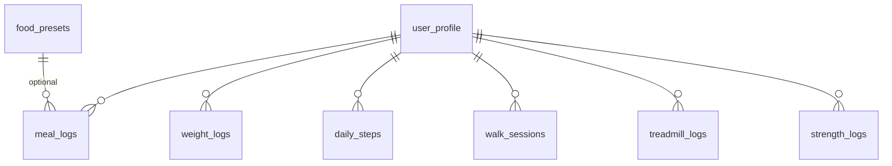
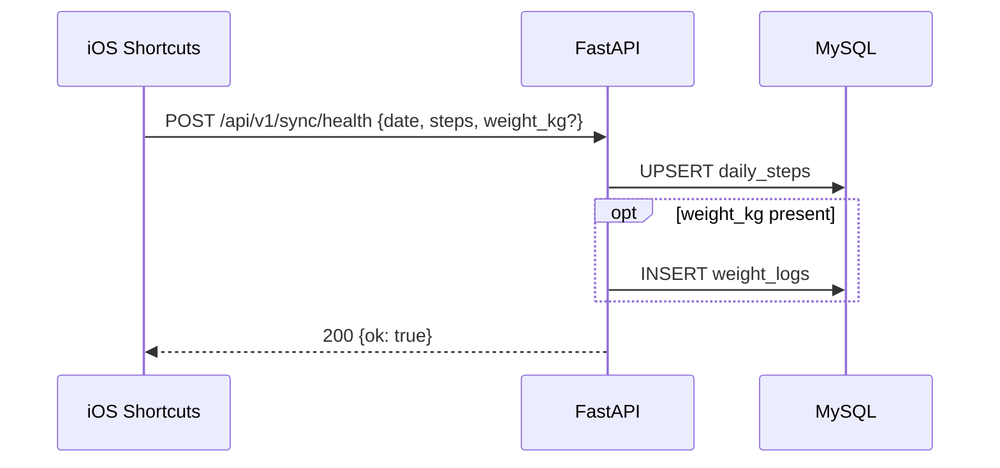
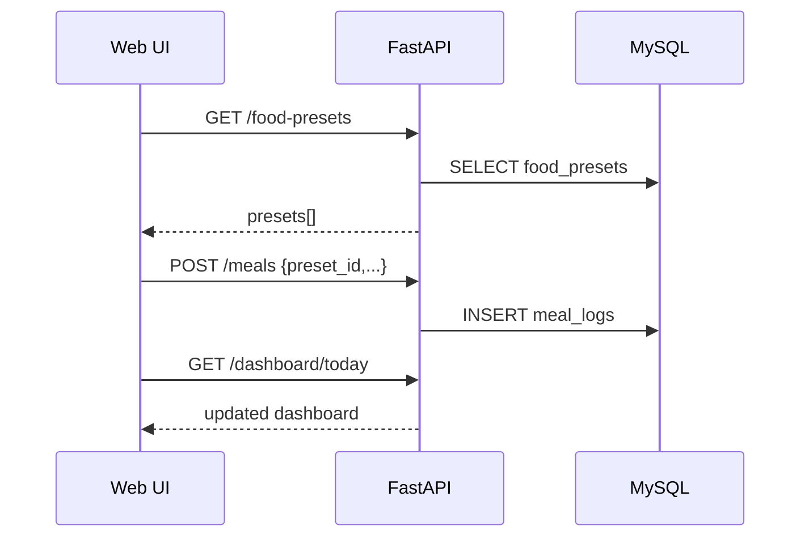
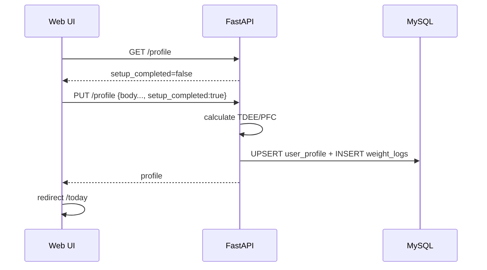

# 詳細設計書: 散歩判 v1 コア

## 1. 概要

- **担当ユースケース / モジュール:** Profile, Dashboard, Meals, Body, HealthSync, Walks, Exercises, Summary, Frontend Shell（全モジュール）
- **担当する要件 ID:** FR-001〜013, FR-017〜033（Phase 1 必須）
- **要件定義書:** `docs/features/sanpo-ban/requirements.md`
- **基本設計書:** `docs/features/sanpo-ban/basic-design.md`
- **デザインシステム:** notion（`.agents/resources/design-systems/notion/DESIGN.md`）
- **対象バージョン:** v1

**設計判断（DD-004）:** 日次集計キャッシュテーブル（DailySummary）は **設けない**。Dashboard / Summary は SQL 集計 + アプリ層計算で都度算出する。

## 2. API 設計

ベース URL: `http://<host>:8080`  
プレフィックス: `/api/v1`  
タイムゾーン: `Asia/Tokyo`  
認証: 全エンドポイント **不要**（ROLE-001 前提・LAN 内）

### 2.1 エンドポイント一覧

| メソッド | パス | 概要 | 要件 ID | 必要ロール |
|----------|------|------|---------|-----------|
| GET | `/api/v1/profile` | プロファイル取得 | FR-001〜004 | ROLE-001 |
| PUT | `/api/v1/profile` | プロファイル更新・初回設定 | FR-001〜004 | ROLE-001 |
| POST | `/api/v1/profile/recalculate-targets` | TDEE/PFC 再提案 | FR-002, FR-003 | ROLE-001 |
| GET | `/api/v1/dashboard/today` | 今日ダッシュボード | FR-005〜009 | ROLE-001 |
| GET | `/api/v1/food-presets` | プリセット一覧 | FR-010, FR-011 | ROLE-001 |
| POST | `/api/v1/food-presets` | プリセット作成 | FR-010 | ROLE-001 |
| PUT | `/api/v1/food-presets/{id}` | プリセット更新 | FR-010 | ROLE-001 |
| DELETE | `/api/v1/food-presets/{id}` | プリセット削除 | FR-010 | ROLE-001 |
| GET | `/api/v1/meals` | 食事ログ一覧（日付指定） | FR-013 | ROLE-001 |
| POST | `/api/v1/meals` | 食事追加 | FR-011, FR-012 | ROLE-001 |
| DELETE | `/api/v1/meals/{id}` | 食事削除 | FR-013 | ROLE-001 |
| POST | `/api/v1/meals/{id}/duplicate` | 別日へ複製 | FR-014 | ROLE-001 |
| GET | `/api/v1/weights` | 体重履歴 | FR-019 | ROLE-001 |
| POST | `/api/v1/weights` | 体重手入力 | FR-017 | ROLE-001 |
| POST | `/api/v1/sync/health` | iPhone 歩数・体重同期 | FR-020〜023 | ROLE-001 |
| GET | `/api/v1/walks` | 散歩履歴 | FR-026 | ROLE-001 |
| POST | `/api/v1/walks` | 散歩記録 | FR-024, FR-025 | ROLE-001 |
| GET | `/api/v1/exercises/treadmill` | トレッドミル一覧 | FR-027 | ROLE-001 |
| POST | `/api/v1/exercises/treadmill` | トレッドミル記録 | FR-027〜029 | ROLE-001 |
| DELETE | `/api/v1/exercises/treadmill/{id}` | トレッドミル削除 | FR-027 | ROLE-001 |
| GET | `/api/v1/exercises/strength` | 筋トレ一覧 | FR-030 | ROLE-001 |
| POST | `/api/v1/exercises/strength` | 筋トレ記録 | FR-030, FR-031 | ROLE-001 |
| DELETE | `/api/v1/exercises/strength/{id}` | 筋トレ削除 | FR-030 | ROLE-001 |
| GET | `/api/v1/exercises/strength/templates` | 種目テンプレ | FR-030 | ROLE-001 |
| GET | `/api/v1/summary/week` | 週サマリー | FR-033 | ROLE-001 |

### 2.2 エンドポイント詳細

#### `GET /api/v1/dashboard/today`

- **クエリ:** `date`（YYYY-MM-DD、省略時は JST 今日）
- **レスポンス（200）**

```json
{
  "date": "2026-06-13",
  "targets": {
    "kcal": 2000,
    "protein_g": 120.0,
    "fat_g": 56.0,
    "carbs_g": 225.0
  },
  "intake": {
    "kcal": 1680,
    "protein_g": 95.0,
    "fat_g": 48.0,
    "carbs_g": 180.0
  },
  "burn": {
    "walk_kcal": 360,
    "treadmill_kcal": 280,
    "strength_kcal": 150,
    "total_kcal": 790
  },
  "remaining": {
    "kcal": 1110,
    "protein_g": 25.0,
    "fat_g": 8.0,
    "carbs_g": 45.0
  },
  "steps": 8432,
  "weight_kg": 72.4,
  "walk_sessions_today": 1
}
```

- **計算:** 基本設計 §4.2 の式。`weight_kg` は当日最新 WeightLog、なければ profile 初期体重。

#### `PUT /api/v1/profile`

```json
{
  "height_cm": 175.0,
  "birth_date": "1990-01-15",
  "sex": "male",
  "activity_factor": 1.375,
  "current_weight_kg": 72.4,
  "target_kcal": 2000,
  "target_protein_g": 120.0,
  "target_fat_g": 56.0,
  "target_carbs_g": 225.0,
  "setup_completed": true
}
```

- `target_*` 省略時は `POST /profile/recalculate-targets` と同ロジックで自動算出して保存。

#### `POST /api/v1/meals`

```json
{
  "log_date": "2026-06-13",
  "name": "ツナマヨおにぎり",
  "kcal": 188,
  "protein_g": 6.0,
  "fat_g": 5.0,
  "carbs_g": 28.0,
  "food_preset_id": 3
}
```

#### `POST /api/v1/sync/health`

```json
{
  "date": "2026-06-13",
  "steps": 8432,
  "weight_kg": 72.4
}
```

- `steps`: 必須。`daily_steps` を upsert（同日は上書き）
- `weight_kg`: 任意。指定時は `weight_logs` に `source=shortcuts` で INSERT

#### `POST /api/v1/walks`

```json
{
  "discovery_note": "川沿いにカモがいた"
}
```

- `walked_at` 省略時はサーバー現在時刻（JST）

#### `POST /api/v1/exercises/treadmill`

```json
{
  "minutes": 30,
  "speed_kmh": 8.5,
  "incline_pct": 1.0,
  "machine_kcal": null
}
```

- レスポンスに `calculated_kcal` を含む

#### `POST /api/v1/exercises/strength`

```json
{
  "exercise_code": "chest",
  "minutes": 45
}
```

#### `GET /api/v1/summary/week`

- **クエリ:** `end_date`（省略時 JST 今日）。起点 `end_date - 6 日`
- **レスポンス（200）**

```json
{
  "start_date": "2026-06-07",
  "end_date": "2026-06-13",
  "avg_intake_kcal": 1850,
  "avg_steps": 9200,
  "weight_trend": [
    {"date": "2026-06-07", "weight_kg": 72.8},
    {"date": "2026-06-13", "weight_kg": 72.4}
  ],
  "counts": {
    "walk_sessions": 5,
    "treadmill_sessions": 2,
    "strength_sessions": 3
  }
}
```

## 3. データベース設計

文字セット: `utf8mb4` / `utf8mb4_unicode_ci`  
エンジン: InnoDB

### 3.1 ER 概要



単一利用者のため `user_profile.id = 1` 固定。子テーブルに `user_profile_id` は持たず、1 行前提で設計（将来マルチユーザー化時に migration）。

### 3.2 テーブル定義

#### `user_profile`

| カラム | 型 | NULL | デフォルト | 説明 |
|--------|-----|------|-----------|------|
| id | BIGINT | NO | 1 | PK（常に 1） |
| height_cm | DECIMAL(5,2) | NO | | 身長 cm |
| birth_date | DATE | NO | | 生年月日 |
| sex | ENUM('male','female') | NO | | 性別 |
| activity_factor | DECIMAL(4,3) | NO | 1.375 | 活動係数 |
| target_kcal | INT | NO | | 目標 kcal |
| target_protein_g | DECIMAL(6,2) | NO | | 目標 P g |
| target_fat_g | DECIMAL(6,2) | NO | | 目標 F g |
| target_carbs_g | DECIMAL(6,2) | NO | | 目標 C g |
| initial_weight_kg | DECIMAL(5,2) | NO | | 設定時体重 |
| setup_completed | TINYINT(1) | NO | 0 | 初回設定完了 |
| created_at | DATETIME(3) | NO | CURRENT_TIMESTAMP(3) | |
| updated_at | DATETIME(3) | NO | CURRENT_TIMESTAMP(3) ON UPDATE | |

#### `food_presets`

| カラム | 型 | NULL | デフォルト | 説明 |
|--------|-----|------|-----------|------|
| id | BIGINT | NO | AUTO_INCREMENT | PK |
| name | VARCHAR(200) | NO | | 食品名 |
| kcal | INT | NO | | |
| protein_g | DECIMAL(6,2) | NO | | |
| fat_g | DECIMAL(6,2) | NO | | |
| carbs_g | DECIMAL(6,2) | NO | | |
| sort_order | INT | NO | 0 | 表示順 |
| created_at | DATETIME(3) | NO | | |
| updated_at | DATETIME(3) | NO | | |

**インデックス:** `idx_food_presets_sort (sort_order, id)`

#### `meal_logs`

| カラム | 型 | NULL | デフォルト | 説明 |
|--------|-----|------|-----------|------|
| id | BIGINT | NO | AUTO_INCREMENT | PK |
| log_date | DATE | NO | | JST 記録日 |
| name | VARCHAR(200) | NO | | |
| kcal | INT | NO | | |
| protein_g | DECIMAL(6,2) | NO | | |
| fat_g | DECIMAL(6,2) | NO | | |
| carbs_g | DECIMAL(6,2) | NO | | |
| food_preset_id | BIGINT | YES | NULL | FK → food_presets.id |
| logged_at | DATETIME(3) | NO | | 記録日時 |

**インデックス:** `idx_meal_logs_date (log_date, logged_at)`  
**外部キー:** `food_preset_id` → `food_presets(id)` ON DELETE SET NULL

#### `daily_steps`

| カラム | 型 | NULL | デフォルト | 説明 |
|--------|-----|------|-----------|------|
| id | BIGINT | NO | AUTO_INCREMENT | PK |
| step_date | DATE | NO | | UNIQUE |
| steps | INT | NO | | 歩数 |
| source | VARCHAR(50) | NO | 'shortcuts' | |
| synced_at | DATETIME(3) | NO | | 最終同期 |

**インデックス:** `uq_daily_steps_date (step_date)` UNIQUE

#### `weight_logs`

| カラム | 型 | NULL | デフォルト | 説明 |
|--------|-----|------|-----------|------|
| id | BIGINT | NO | AUTO_INCREMENT | PK |
| weight_kg | DECIMAL(5,2) | NO | | |
| source | ENUM('manual','shortcuts') | NO | | |
| logged_at | DATETIME(3) | NO | | |

**インデックス:** `idx_weight_logs_logged_at (logged_at)`

#### `walk_sessions`

| カラム | 型 | NULL | デフォルト | 説明 |
|--------|-----|------|-----------|------|
| id | BIGINT | NO | AUTO_INCREMENT | PK |
| walked_at | DATETIME(3) | NO | | |
| discovery_note | TEXT | YES | NULL | 発見メモ |

**インデックス:** `idx_walk_sessions_walked_at (walked_at)`

#### `treadmill_logs`

| カラム | 型 | NULL | デフォルト | 説明 |
|--------|-----|------|-----------|------|
| id | BIGINT | NO | AUTO_INCREMENT | PK |
| logged_at | DATETIME(3) | NO | | |
| minutes | INT | NO | | |
| speed_kmh | DECIMAL(4,1) | YES | NULL | |
| incline_pct | DECIMAL(4,1) | YES | NULL | |
| machine_kcal | INT | YES | NULL | マシン表示 |
| calculated_kcal | INT | NO | | 保存時算出 |

**インデックス:** `idx_treadmill_logs_logged_at (logged_at)`

#### `strength_logs`

| カラム | 型 | NULL | デフォルト | 説明 |
|--------|-----|------|-----------|------|
| id | BIGINT | NO | AUTO_INCREMENT | PK |
| logged_at | DATETIME(3) | NO | | |
| exercise_code | VARCHAR(20) | NO | | chest/back/legs 等 |
| minutes | INT | NO | | |
| calculated_kcal | INT | NO | | |

**インデックス:** `idx_strength_logs_logged_at (logged_at)`

## 4. 画面詳細（Notion デザインシステム）

**参照:** `.agents/resources/design-systems/notion/DESIGN.md`

### 4.1 共通 UI トークン

| 用途 | トークン |
|------|----------|
| ページ背景 | `surface` #f6f5f4 |
| カード背景 | `canvas` #ffffff |
| 本文 | `charcoal` #37352f |
| 補助文 | `slate` #5d5b54 |
| プライマリボタン | `primary` #5645d4 / 角丸 pill |
| 区切り線 | `hairline` #e5e3df |
| フォント | Notion Sans, Inter, system-ui |

**下部タブ:** 背景 `surface-soft` #fafaf9。アクティブ `primary`、非アクティブ `steel` #787671。

### 4.2 画面一覧

| 画面 | 項目 | 必須 | バリデーション | API |
|------|------|------|---------------|-----|
| 初回設定 | 身長 cm | ○ | 100–250 | PUT /profile |
| 初回設定 | 生年月日 | ○ | 過去日 | PUT /profile |
| 初回設定 | 性別 | ○ | male/female | PUT /profile |
| 初回設定 | 体重 kg | ○ | 30–300 | PUT /profile |
| 初回設定 | 活動係数 | ○ | 1.2/1.375/1.55/1.725 | PUT /profile |
| 今日 | （表示のみ） | — | — | GET /dashboard/today |
| 食事 | プリセットグリッド | — | — | GET /food-presets, POST /meals |
| 食事 | 手入力フォーム | ○ name,kcal,P,F,C | kcal≥0 | POST /meals |
| 散歩 | 散歩したボタン | — | — | POST /walks |
| 散歩 | 発見メモ | — | max 500 字 | POST /walks |
| 運動 | トレッドミル分数 | ○ | 1–300 | POST /exercises/treadmill |
| 運動 | 筋トレ種目+分数 | ○ | テンプレ選択 | POST /exercises/strength |
| 週 | （表示のみ） | — | — | GET /summary/week |
| 設定 | 目標 kcal/PFC | ○ | kcal≥1200 | PUT /profile |

### 4.3 今日画面レイアウト（Notion カード）

| カード | 背景 tint | 内容 |
|--------|-----------|------|
| 残り kcal | `card-tint-mint` #d9f3e1 | 大数字 + 目標比プログレス |
| 摂取 PFC | `card-tint-peach` #ffe8d4 | P / F / C 残量バー |
| 消費 | `card-tint-sky` #dcecfa | 歩行+トレッドミル+筋トレ内訳 |
| 歩数・体重 | `card-tint-lavender` #e6e0f5 | 歩数、体重 |
| 散歩 FAB | `primary` pill | 画面右下固定「散歩した」 |

### 4.4 PWA

- `manifest.json`: `name: 散歩判`, `display: standalone`, `theme_color: #5645d4`
- アイコン: Phase 1 はプレースホルダ

## 5. エラーハンドリング

### 5.1 エラーコード一覧

| コード | HTTP | 説明 | 発生条件 |
|--------|------|------|----------|
| VALIDATION_ERROR | 400 | 入力不正 | 必須欠落・範囲外 |
| NOT_FOUND | 404 | リソースなし | 存在しない id |
| PROFILE_NOT_SETUP | 409 | 未設定 | setup_completed=false で dashboard 等 |
| INTERNAL_ERROR | 500 | サーバー異常 | 予期せぬ例外 |

**レスポンス形式:**

```json
{
  "error": {
    "code": "VALIDATION_ERROR",
    "message": "height_cm must be between 100 and 250"
  }
}
```

### 5.2 共通方針

- 500 時はスタックトレースをクライアントに返さない
- ログは structlog / standard logging で INFO（sync）/ ERROR

## 6. シーケンス

### 6.1 iPhone 歩数同期



### 6.2 食事プリセット追加



### 6.3 初回設定



## 7. 認可の実装方針

| リソース / 操作 | チェック内容 | 要件 ID |
|----------------|-------------|---------|
| 全 API | チェックなし（LAN 内単一利用者） | NFR-002 |

403 は Phase 1 では使用しない。将来 Basic 認証導入時に middleware を追加。

## 8. iOS ショートカット設定（DD-003）

1. ショートカット App → 自動化 → 時間間隔（1 時間）または「到着/退出」
2. アクション追加:
   - 「ヘルスケアの値を取得」→ タイプ「歩数」、期間「今日」
   - （任意）「ヘルスケアの値を取得」→ タイプ「体重」、期間「最新」
   - 「URL の内容を取得」POST  
     URL: `http://<PiまたはPCのIP>:8080/api/v1/sync/health`  
     本文 JSON:
     ```json
     {"date":"{{現在の日付}}","steps":{{歩数}},"weight_kg":{{体重}}}
     ```
3. 「ローカルネットワーク」許可を有効化

**注意:** トレッドミル中にスマホを持ち、かつトレッドミルを手入力すると二重計上される。ジムでは手入力のみ、またはスマホのみ（手入力なし）を推奨。

## 9. 要件トレーサビリティ

| 要件 ID | 詳細設計要素 |
|---------|-------------|
| FR-001〜004 | user_profile, PUT/GET /profile |
| FR-005〜009 | GET /dashboard/today, 今日画面 |
| FR-010〜013 | food_presets, meal_logs, 食事画面 |
| FR-014 | POST /meals/{id}/duplicate |
| FR-017〜019 | weight_logs, POST/GET /weights |
| FR-020〜023 | daily_steps, POST /sync/health |
| FR-024〜026 | walk_sessions, 散歩画面 |
| FR-027〜029 | treadmill_logs, 運動画面 |
| FR-030〜031 | strength_logs, 種目テンプレ API |
| FR-033 | GET /summary/week, 週画面 |

## 10. 未決事項

| ID | 内容 | 実装で解決 |
|----|------|-----------|
| IMP-001 | Alembic 初回 migration ファイル名 | はい |
| IMP-002 | 週サマリー体重推移の「日付に記録なし」の補間 | はい（前日値 carry または null） |

## 変更履歴

| 日付 | 変更内容 |
|------|----------|
| 2026-06-13 | 初版作成（Notion UI、MySQL スキーマ、API 一覧） |
